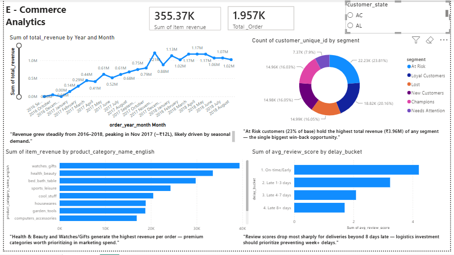

# E-Commerce Sales & Customer Analytics

End-to-end analysis of 100K+ orders from the Olist Brazilian E-Commerce dataset, using Python, SQL, and Power BI to uncover revenue drivers, customer segments, and delivery performance issues — with business recommendations, not just charts.

## Business Problem

Olist is a Brazilian e-commerce platform connecting small sellers to major marketplaces. This project analyzes their order, customer, and delivery data to answer:
- Which product categories and regions drive the most revenue?
- How should customers be segmented, and where's the biggest retention opportunity?
- Does delivery delay actually hurt customer satisfaction, and by how much?

## Tools Used
- **Python (Pandas, scikit-learn, Hugging Face Transformers)** — data cleaning, merging 9 relational tables, feature engineering (RFM, delivery delay), a churn prediction model, and NLP-based review sentiment analysis
- **SQL (SQLite)** — business-question queries (revenue by category, monthly trends, top sellers, regional breakdown, RFM segment summary)
- **Power BI** — interactive dashboard with KPIs, trend lines, segment visuals, and a state-level slicer

## Key Findings

1. **At Risk customers hold the highest total revenue of any segment** — ₹3.96M across 22,230 customers (23% of the base) — larger than the "Champions" segment (₹2.76M). This makes targeted win-back campaigns the single highest-ROI retention opportunity.

2. **Health & Beauty (₹1.46M) and Watches/Gifts (₹1.32M) generate the highest revenue despite fewer orders** than categories like Bed/Bath/Table (9,272 orders) — indicating a higher average order value. These premium categories are worth prioritizing in marketing spend, while high-volume categories need a different, volume-driven strategy.

3. **Review scores drop most sharply once deliveries are 8+ days late**, while 1-3 day delays show only a minor impact. This means logistics investment has the highest payoff when focused on preventing long delays, not minor slippage.

4. **The business is geographically concentrated in São Paulo (SP)** — SP customers alone generate ₹6.07M in revenue (3x the next closest state, Rio de Janeiro at ₹2.17M), and 9 of the top 10 sellers by revenue are also based in SP. This concentration is a risk worth flagging for regional diversification.

5. **Monthly revenue grew consistently from late 2016 through 2018**, peaking in November 2017 (₹1.2M) — likely a seasonal/Black Friday effect. Data coverage ends mid-2018, reflecting the dataset's collection window rather than an actual business decline.

## Churn Prediction Model

Extended the analysis with a machine learning model to predict customer churn, using RFM and delivery/review behavior as features.

- **Approach**: Labeled customers as churned based on recency (top 25% most inactive). Trained a Random Forest classifier using frequency, monetary value, average delivery delay, and average review score as predictors.
- **Data leakage caught and fixed**: Initial model scored 100% accuracy — investigation revealed recency (used to define the churn label) was also included as a feature, causing leakage. Removed it and retrained.
- **Final model**: 64% accuracy, with class balancing applied to improve recall on the minority "churned" class (0.29 → 0.37).
- **Key finding**: Monetary value was by far the strongest churn predictor (88% feature importance) — far more than delivery delay or review score — suggesting spend level, not service experience, is the primary retention risk factor in this dataset.

*Notebook: `notebooks/02_churn_prediction.ipynb`*

## Review Sentiment & Theme Analysis

Extended the project further with an NLP layer analyzing the unstructured review text (`review_comment_message`), which the earlier structured analysis didn't touch.

- **Sentiment Analysis**: Used a pre-trained multilingual BERT model (`nlptown/bert-base-multilingual-uncased-sentiment`) to classify sentiment on a sample of 3,000 written Portuguese reviews, with no translation needed.
- **Theme Classification**: Tagged reviews into complaint/praise themes (late delivery, product quality, packaging damage, customer service, wrong item, good experience) using a keyword-based rule system, chosen after zero-shot transformer classification proved too slow to run at scale locally — a practical tradeoff between depth and runtime.
- **Key finding**: Among negative reviews with an identifiable theme, **late delivery was the most common complaint** (80 mentions), followed by product quality (66) and packaging damage (61) — directly reinforcing the earlier finding that delivery delay strongly impacts review scores, now confirmed independently through the review text itself.

*Notebook: `notebooks/03_review_sentiment.ipynb`*

## Dashboard

The dashboard includes:
- KPI cards (total revenue, total orders)
- Monthly revenue trend line
- Top 10 categories by revenue
- Customer segment breakdown (RFM)
- Delivery delay vs. review score comparison
- Interactive state-level slicer

## Project Structure

data/processed/ - Cleaned datasets and exports used for Power BI (raw data excluded due to size)
notebooks/ - Python notebooks for data cleaning, merging, RFM segmentation, feature engineering, churn model, and review sentiment analysis
sql/queries.sql - Documented SQL queries for all business questions
dashboard/ - Power BI (.pbix) dashboard file
images/ - Dashboard screenshot and complaint themes chart

## Methodology

1. **Data Cleaning**: Merged 9 relational tables (orders, customers, products, sellers, payments, reviews, geolocation) using appropriate join types; handled missing values contextually (e.g., undelivered orders naturally lack delivery timestamps) and deduplicated geolocation data by zip prefix.
2. **Feature Engineering**: Calculated delivery delay (actual vs. estimated delivery date), monthly order periods, and item-level revenue.
3. **RFM Segmentation**: Scored all customers on Recency, Frequency, and Monetary value using quintile-based scoring, then classified them into six actionable segments (Champions, Loyal Customers, At Risk, Lost, New Customers, Needs Attention).
4. **SQL Analysis**: Loaded the cleaned dataset into SQLite and wrote queries answering each business question independently of the Python analysis, to demonstrate both toolsets.
5. **Churn Modeling**: Built a Random Forest classifier on top of RFM and delivery/review features, catching and correcting a data leakage issue before arriving at a realistic, defensible model.
6. **Review Sentiment Analysis**: Applied a pre-trained multilingual sentiment model and keyword-based theme tagging to unstructured review text, surfacing complaint themes invisible from star ratings alone.
7. **Dashboard**: Built an interactive Power BI dashboard translating each finding into a visual, paired with a written business recommendation.

## How to Reproduce

1. Download the raw dataset from [Kaggle - Olist Brazilian E-Commerce](https://www.kaggle.com/datasets/olistbr/brazilian-ecommerce)
2. Place the extracted CSVs into `data/raw/`
3. Run the notebooks in `notebooks/` in order to clean, merge, export data, train the churn model, and run sentiment analysis
4. Open `dashboard/ecommerce_dashboard.pbix` in Power BI Desktop to view the interactive dashboard

## Author

**Pratyush Sachan**
[LinkedIn](https://www.linkedin.com/in/pratyushsachan/) | [GitHub](https://github.com/pratyushsachan/Ecommerce-Sales-Analytics)